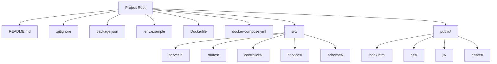
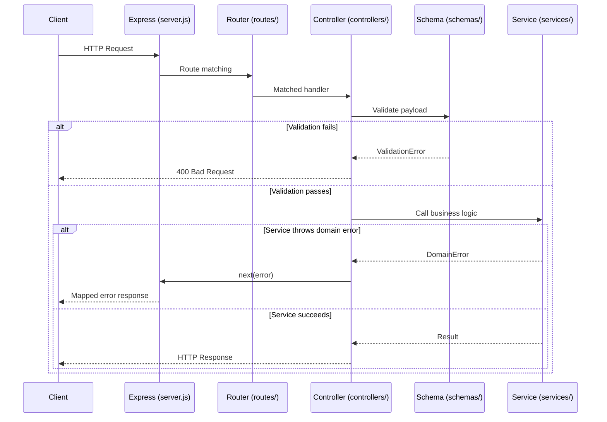

# Design Document: website-deploy-structure

## Overview

This feature defines the canonical folder structure and configuration files required to deploy a full-stack web application. The structure supports:

- A Node.js/Express backend with a layered architecture (routes → controllers → services → schemas)
- Static frontend assets served from the same origin as the API
- Containerized deployment via Docker using a Node.js base image
- Standard developer tooling (npm, git, environment configuration)

The output is a scaffold — a set of files and directories that, once created, constitutes a valid, deployable full-stack project. Correctness is defined by the presence, location, and content of specific files, and by the behavioral contracts between architectural layers.

---

## Architecture

The project is organized into three logical zones:

1. **Project Root** — metadata, configuration, and tooling files consumed by developer tools, CI/CD pipelines, and container runtimes.
2. **`src/`** — all backend source code, organized into layers: server entry point, routes, controllers, services, and schemas.
3. **`public/`** — the web-servable subtree for static frontend assets, served by the Express backend from the same origin.



Request flow through the backend layers:



---

## Components and Interfaces

### 1. Backend Server Entry Point (`src/server.js`)

Initializes the Express application, registers middleware (JSON body parsing, CORS, static file serving), mounts all route modules, attaches error-handling middleware, and starts listening on a configurable port.

**Port resolution**: reads `process.env.PORT`; falls back to a hardcoded default (e.g., `3000`) if the variable is absent.

**Static serving**: mounts `express.static('public')` so the frontend is accessible at the same origin as the API.

### 2. Routes Layer (`src/routes/`)

One module per resource or feature domain. Each module creates an Express `Router`, declares HTTP method + path combinations, and delegates to the corresponding controller handler. Contains no business logic.

**404 handling**: a catch-all route at the end of the router chain returns a structured JSON error for unmatched paths.

### 3. Controllers Layer (`src/controllers/`)

One module per resource or feature domain. Each controller function:
1. Extracts input from `req.params`, `req.query`, and `req.body`
2. Validates the payload using the corresponding schema
3. Calls the service layer
4. Maps the result to an HTTP status code and response body
5. Calls `next(error)` on any thrown error — never handles errors inline

Controllers do not contain business logic or data-access calls.

### 4. Services Layer (`src/services/`)

One module per resource or feature domain. Service functions:
- Encapsulate all business rules and orchestration logic
- Validate domain invariants before performing state-changing operations
- Throw typed `DomainError` instances on rule violations
- Never import or reference Express `req`/`res` objects

### 5. Schemas Layer (`src/schemas/`)

One module per resource or feature domain. Uses a validation library (Joi or Zod) to define field names, types, and constraints for each data model. Schemas are the single source of truth for payload validation and, where an ORM is used, for the data model definition.

### 6. Frontend (`public/`)

Static files served by Express via `express.static`. The entry point `public/index.html` references assets using root-relative paths.

| Directory | Purpose |
|---|---|
| `public/index.html` | HTML entry point (REQUIRED) |
| `public/css/` | Stylesheet files |
| `public/js/` | Client-side JavaScript |
| `public/assets/` | Images, fonts, and other binary resources |

### 7. Dockerfile

Uses `node:lts-alpine` as the base image. Copies source and installs production dependencies, then starts the Express server.

```
Base image: node:lts-alpine
WORKDIR: /app
COPY: package*.json → /app/
RUN: npm ci --omit=dev
COPY: . → /app/
EXPOSE: 3000 (or configured port)
CMD: ["node", "src/server.js"]
```

### 8. Docker Compose (`docker-compose.yml`)

Defines a single `app` service that builds from the project root `Dockerfile`, maps host port `3000` to container port `3000`, and passes environment variables from a `.env` file.

### 9. Project Configuration Files

| File | Purpose |
|---|---|
| `package.json` | Dependencies, `start` script (`node src/server.js`), dev scripts |
| `.env.example` | Documents all required env vars (e.g., `PORT`, `NODE_ENV`) without secret values |
| `.gitignore` | Excludes `.env`, `node_modules/`, build artifacts |
| `README.md` | Project description, setup, and deployment instructions |

---

## Data Models

The canonical file system layout:

```
<project-root>/
├── src/
│   ├── server.js               # Express app entry point (REQUIRED)
│   ├── routes/
│   │   └── index.js            # Route module(s) per domain
│   ├── controllers/
│   │   └── exampleController.js
│   ├── services/
│   │   └── exampleService.js
│   └── schemas/
│       └── exampleSchema.js
├── public/
│   ├── index.html              # Frontend entry point (REQUIRED)
│   ├── css/
│   │   └── .gitkeep
│   ├── js/
│   │   └── .gitkeep
│   └── assets/
│       └── .gitkeep
├── Dockerfile                  # Node.js container build definition
├── docker-compose.yml          # Compose service definition
├── package.json                # npm metadata and scripts
├── .env.example                # Environment variable documentation
├── .gitignore                  # VCS exclusions
└── README.md                   # Project documentation
```

### Validity Model

A deploy structure is **valid** if and only if:

| Condition | Required for |
|---|---|
| `public/index.html` exists | Frontend delivery |
| `src/server.js` exists | Backend operation |
| `src/routes/` exists | Request routing |
| `src/controllers/` exists | HTTP handling |
| `src/services/` exists | Business logic |
| `src/schemas/` exists | Payload validation |
| `Dockerfile` exists | Container-based deployment |
| `docker-compose.yml` exists | Orchestrated deployment |
| `package.json` with `start` script exists | Standard tooling |
| `.env.example` exists | Environment documentation |

---

## Correctness Properties

*A property is a characteristic or behavior that should hold true across all valid executions of a system — essentially, a formal statement about what the system should do. Properties serve as the bridge between human-readable specifications and machine-verifiable correctness guarantees.*

### Property 1: All required root-level files exist

*For any* generated deploy structure, the project root SHALL contain `README.md`, `.gitignore`, `package.json`, `.env.example`, `Dockerfile`, and `docker-compose.yml`.

**Validates: Requirements 4.1, 4.2, 4.3, 5.1, 6.1, 12.1, 12.2**

---

### Property 2: All required src/ subdirectories exist

*For any* generated deploy structure, the `src/` directory SHALL contain `server.js` and subdirectories `routes/`, `controllers/`, `services/`, and `schemas/`.

**Validates: Requirements 7.1, 8.1, 9.1, 10.1, 11.1**

---

### Property 3: All required public/ subdirectories and entry point exist

*For any* generated deploy structure, `public/index.html` SHALL exist and be non-empty, and `public/` SHALL contain `css/`, `js/`, and `assets/` subdirectories.

**Validates: Requirements 1.1, 1.3, 2.1, 2.2, 2.3**

---

### Property 4: Asset references in index.html resolve under public/

*For any* `index.html` that contains `<link>`, `<script>`, or `` tags referencing local paths, each referenced path SHALL resolve to an existing file or directory under `public/`.

**Validates: Requirements 2.4**

---

### Property 5: Dockerfile contains required Node.js instructions

*For any* generated `Dockerfile`, it SHALL contain a `FROM` instruction specifying a Node.js base image, `COPY` and `RUN npm` instructions for dependency installation, a `COPY` instruction for the application source, and an `EXPOSE` instruction declaring the HTTP port.

**Validates: Requirements 5.4**

---

### Property 6: docker-compose.yml references the Dockerfile as build context

*For any* generated `docker-compose.yml`, the service definition SHALL include a `build` key whose context points to the directory containing the `Dockerfile`.

**Validates: Requirements 6.3**

---

### Property 7: package.json defines a start script

*For any* generated `package.json`, it SHALL include a `scripts.start` field that launches the backend server.

**Validates: Requirements 12.1**

---

### Property 8: .gitignore excludes .env and node_modules

*For any* generated `.gitignore`, it SHALL contain entries that exclude `.env` and `node_modules/` from version control.

**Validates: Requirements 12.3**

---

### Property 9: Schema validation rejects invalid payloads with 400

*For any* request payload that fails schema validation, the controller SHALL return an HTTP 400 response containing the validation error details, and the service layer SHALL NOT be invoked.

**Validates: Requirements 11.3, 9.2**

---

### Property 10: Schema accepts valid data and rejects invalid data (round-trip)

*For any* schema definition, a payload that satisfies all field constraints SHALL pass validation, and a payload that violates any constraint SHALL fail validation with a descriptive error.

**Validates: Requirements 11.4**

---

### Property 11: Service throws typed errors on domain violations

*For any* service method called with inputs that violate domain invariants, the service SHALL throw a typed error before performing any state-changing operation, and the error SHALL be mappable to an HTTP status code by the controller.

**Validates: Requirements 10.3, 10.5**

---

### Property 12: Service layer has no HTTP dependencies

*For any* service module in `src/services/`, the module SHALL NOT import or reference Express request/response objects (`req`, `res`, `next`).

**Validates: Requirements 10.4**

---

## Error Handling

| Condition | Behavior |
|---|---|
| `public/index.html` missing | Structure flagged as invalid for frontend delivery (Req 1.3) |
| `src/server.js` missing | Structure flagged as invalid for backend operation (Req 7.1) |
| `Dockerfile` missing | Structure flagged as incomplete for container deployment (Req 5.3) |
| `docker-compose.yml` missing | Structure flagged as incomplete for orchestrated deployment (Req 6.4) |
| `PORT` env var absent | Server falls back to default port defined in `src/server.js` (Req 7.3) |
| Request path unmatched | Router passes to 404 handler; returns `{ error: "Not Found", path }` JSON (Req 8.4) |
| Schema validation failure | Controller returns 400 with validation error details; service not called (Req 11.3) |
| Service throws `DomainError` | Controller calls `next(error)`; global error handler maps to appropriate HTTP status |
| Service throws unexpected error | Controller calls `next(error)`; global error handler returns 500 |

---

## Testing Strategy

### Dual Testing Approach

Both unit tests and property-based tests are required and complementary:

- **Unit tests** verify specific examples, edge cases, and error conditions with known inputs.
- **Property tests** verify universal structural and behavioral invariants across many randomly generated inputs.

### Unit Tests

Focus on:
- Specific file content examples (e.g., `package.json` contains a `start` script, `.gitignore` contains `node_modules/`)
- Edge cases: missing `src/server.js` triggers invalid-structure error; `PORT` env var absent falls back to default
- Integration: the full scaffold generates end-to-end and passes all structural checks
- 404 handler returns structured JSON for unmatched routes (Req 8.4)
- Controller calls `next(error)` when service throws (Req 9.4)
- Linter config file exists when linting is configured (Req 12.4)

### Property-Based Tests

Use `fast-check` (JavaScript/TypeScript). Each property test MUST run a minimum of **100 iterations**.

Each test MUST be tagged with a comment:
`// Feature: website-deploy-structure, Property <N>: <property_text>`

Each correctness property MUST be implemented by a **single** property-based test.

| Property | Test Description |
|---|---|
| Property 1 | For any scaffold config, all required root-level files are present after generation |
| Property 2 | For any scaffold config, `src/` contains `server.js`, `routes/`, `controllers/`, `services/`, `schemas/` |
| Property 3 | For any scaffold config, `public/index.html` exists and is non-empty, and all `public/` subdirs exist |
| Property 4 | For any `index.html` with local asset references, all referenced paths exist under `public/` |
| Property 5 | For any generated `Dockerfile`, it contains Node.js `FROM`, `COPY`, `RUN npm`, and `EXPOSE` instructions |
| Property 6 | For any generated `docker-compose.yml`, the service `build` context references the project root |
| Property 7 | For any generated `package.json`, `scripts.start` is defined |
| Property 8 | For any generated `.gitignore`, it excludes `.env` and `node_modules/` |
| Property 9 | For any invalid payload, the controller returns 400 and does not invoke the service |
| Property 10 | For any schema, valid payloads pass and invalid payloads fail with descriptive errors |
| Property 11 | For any domain-violating service input, the service throws a typed error before state changes |
| Property 12 | For any service module, it contains no imports of Express req/res objects |
